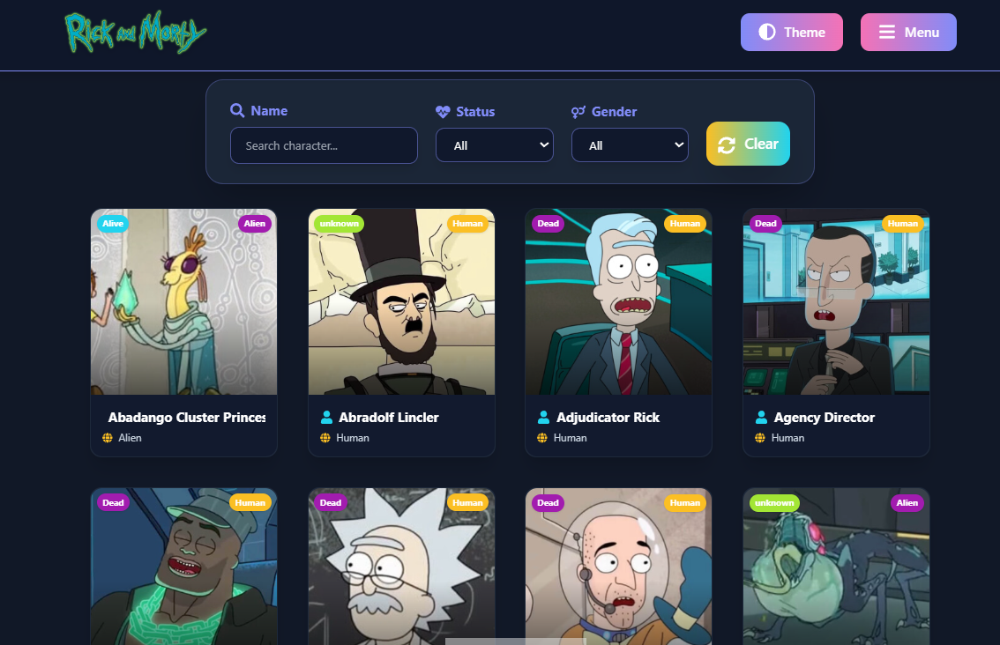

# Rick & Morty Character & Episode Guide

A modern, animated, and themed Rick and Morty SPA. Browse and filter all characters and episodes, discover detailed information, and switch between light, dark, or auto themes!



---

## Features
- 🔍 Character and episode search & filtering
- 🧑‍🚀 Character and episode detail pages (images, badges, links, animation)
- 🌗 Theme switcher (Light/Dark/Auto)
- 🌀 Modern UI: Tailwind CSS, Shadcn UI, Radix UI
- ⚡ Fast and optimized: Vite + TypeScript
- 🖼️ Responsive and accessible (a11y)
- 🎨 Animations and micro-interactions
- 🦾 SEO and social media meta tags
- 🌐 Live data from the Rick and Morty API

---

## Installation

```bash
npm install
npm run dev
```

The app runs by default at [http://localhost:5173](http://localhost:5173).

---

## Tech Stack
- [Vite](https://vitejs.dev/) + [React](https://react.dev/)
- [TypeScript](https://www.typescriptlang.org/)
- [Tailwind CSS](https://tailwindcss.com/)
- [Radix UI](https://www.radix-ui.com/) & [Shadcn UI](https://ui.shadcn.com/)
- [React Router](https://reactrouter.com/)
- [Rick and Morty API](https://rickandmortyapi.com/)

---

## SEO & Meta
- Dynamic `<title>`, `<meta name="description">`, Open Graph and Twitter Card support
- Favicon and social media images

---

## Contributing
Pull requests and suggestions are welcome!

---