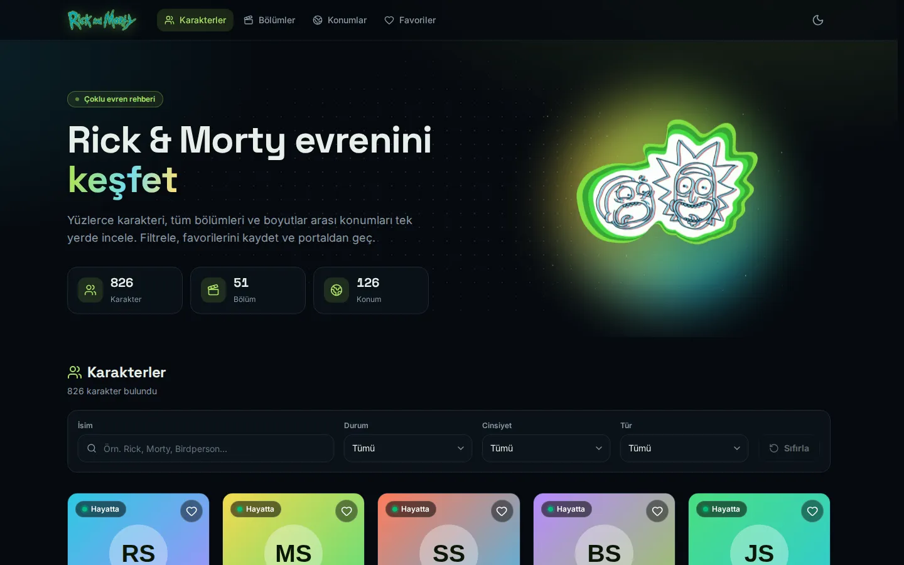
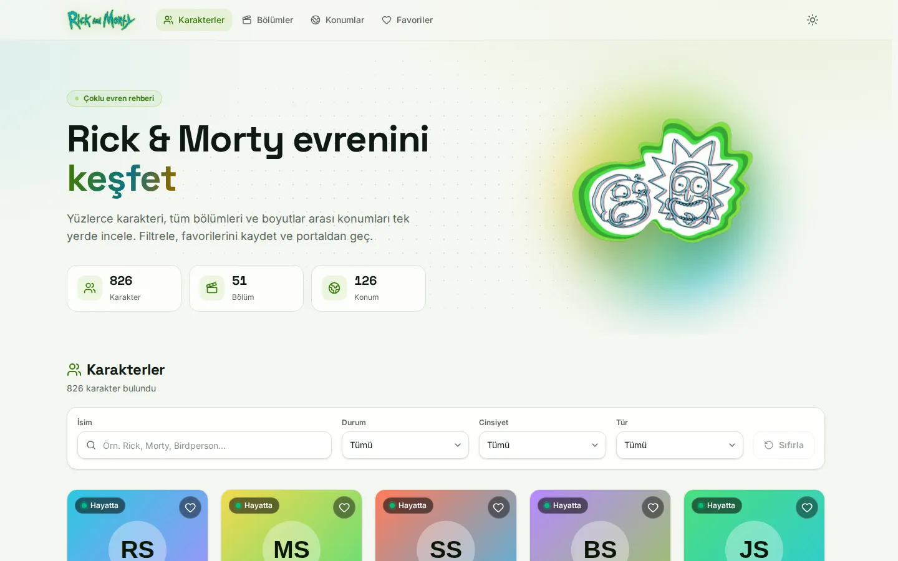
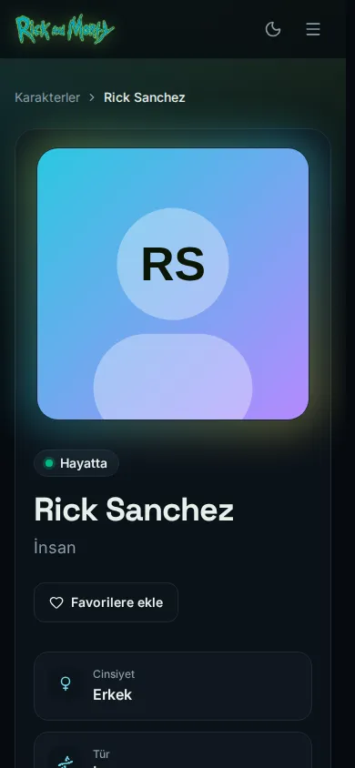

# Rick & Morty Karakter ve Bölüm Rehberi

Rick and Morty evrenindeki **tüm karakterleri, bölümleri ve konumları** keşfetmek için modern, hızlı ve erişilebilir bir tek sayfa uygulaması. Veriler [The Rick and Morty API](https://rickandmortyapi.com/) üzerinden canlı olarak gelir.



<details>
<summary>Açık tema ve mobil görünüm</summary>





</details>

> Ekran görüntüleri örnek verilerle alınmıştır; uygulamada gerçek karakter görselleri görünür.

---

## Özellikler

- **826 karakterin tamamı** — sunucu tarafı filtreleme (isim, durum, cinsiyet, tür) ve sayfalama
- **Paylaşılabilir filtreler** — arama ve sayfa bilgisi URL'de tutulur, geri tuşu çalışır
- **Karakter detayı** — köken ve son konum bağlantıları, ilk/son görünüm, sezonlara göre bölümler, önceki/sonraki karakter
- **Bölümler** — sezon sekmeleri, isim veya kodla (ör. `S03E07`) arama, bölümdeki tüm karakterler
- **Konumlar** — isim ve türe göre arama, her konumun sakinleri
- **Favoriler** — tek dokunuşla kaydet; tarayıcıda saklanır ve sekmeler arasında senkronize olur
- **Açık / koyu / sistem teması** — sayfa açılırken titreme olmadan uygulanır
- **İskelet yükleme ekranları**, boş ve hata durumları (tekrar dene butonuyla)
- **Önbellek** — TanStack Query ile tekrar eden istekler önlenir, sayfa geçişlerinde önceki sonuçlar korunur
- **Erişilebilirlik** — klavye ile gezinme, "içeriğe geç" bağlantısı, ARIA etiketleri, `prefers-reduced-motion` desteği
- **SEO** — sayfa başına dinamik başlık, açıklama, Open Graph / Twitter kartları ve JSON-LD
- Eski `/char/:id` bağlantıları otomatik olarak `/character/:id` adresine yönlenir

## Sayfalar

| Yol              | İçerik                                       |
| ---------------- | -------------------------------------------- |
| `/`              | Karakter listesi, filtreler ve istatistikler |
| `/character/:id` | Karakter detayı                              |
| `/episodes`      | Sezonlara göre bölümler                      |
| `/episodes/:id`  | Bölüm detayı ve karakterleri                 |
| `/locations`     | Konum listesi                                |
| `/locations/:id` | Konum detayı ve sakinleri                    |
| `/favorites`     | Favori karakterler                           |

---

## Kurulum

Node.js **22.22 veya üzeri** gerekir.

```bash
npm install
npm run dev
```

Uygulama varsayılan olarak [http://localhost:5173](http://localhost:5173) adresinde çalışır.

### Komutlar

| Komut                | Açıklama                                  |
| -------------------- | ----------------------------------------- |
| `npm run dev`        | Geliştirme sunucusu                       |
| `npm run build`      | Tip kontrolü + üretim derlemesi (`dist/`) |
| `npm run preview`    | Derlenmiş uygulamayı yerelde sunar        |
| `npm test`           | Testleri bir kez çalıştırır (Vitest)      |
| `npm run test:watch` | Testleri izleme modunda çalıştırır        |
| `npm run lint`       | ESLint                                    |
| `npm run typecheck`  | TypeScript tip kontrolü                   |
| `npm run format`     | Prettier ile biçimlendirme                |

### Docker

```bash
docker compose up --build
```

Üretim imajı uygulamayı nginx ile sunar: SPA yönlendirmesi, `/assets` için uzun süreli önbellek, güvenlik başlıkları ve Open Graph adreslerinin istek yapılan alan adına göre yeniden yazılması dahildir.

---

## Teknolojiler

- [React 19](https://react.dev/) + [TypeScript 6](https://www.typescriptlang.org/)
- [Vite 8](https://vite.dev/) (Rolldown)
- [React Router 8](https://reactrouter.com/)
- [TanStack Query 5](https://tanstack.com/query) — veri çekme ve önbellek
- [Tailwind CSS 4](https://tailwindcss.com/) — tasarım token'ları ile açık/koyu tema
- [Radix UI](https://www.radix-ui.com/) — menü ve mobil çekmece
- [Motion](https://motion.dev/) — sayfa geçişleri
- [Lucide](https://lucide.dev/) — ikonlar
- [Vitest](https://vitest.dev/) + [Testing Library](https://testing-library.com/) — testler

## Proje yapısı

```
src/
├── components/   Yeniden kullanılabilir arayüz bileşenleri (kart, filtre, sayfalama…)
├── hooks/        Tema, favoriler, URL filtreleri, debounce
├── layouts/      Ortak sayfa iskeleti (header, footer, geçişler)
├── lib/          API istemcisi, sorgular, etiketler ve yardımcılar
├── pages/        Rota sayfaları
├── test/         Test kurulumu, sahte veriler ve yardımcılar
├── routes.tsx    Rota tanımları
└── seo.ts        Meta etiketleri ve JSON-LD
```

---

Rick and Morty, Adult Swim'in tescilli markasıdır. Bu proje bir hayran çalışmasıdır.
